## This is a freezer storage tracking Single Page App built in MERN

> I built this app in two versions of the CRUD capability to practice/play around and compare features in Material Table vs. self-built.

> Additional codes commented out are intentionally left in for my learning purposes

Technology used:

- React.js
- Material UI
  - Dark/Light Mode Switcher
  - Autocomplete
  - Date Picker
- Material Table
  - CRUD Capability
- Moment.js
- MomentUtils.js
- Axios
- Reach Router
- Express.js
- Mongoose.js
- MongoDB

Future Improvements:

1. Finish with Delete feature in traditional build version
   - Already built and applied the Delete process with API in Material Table version
1. Build my own fuzzy search
1. Upload capability from .csv file for data pre-existing file load
1. Material Table with Color Theme
   - tried initially the build-in method but it didn't work
   - want to try again with my own makeStyles hook
1. Add Twilio alert messaging for item re-purchase reminder

Here are screenshots for this app:

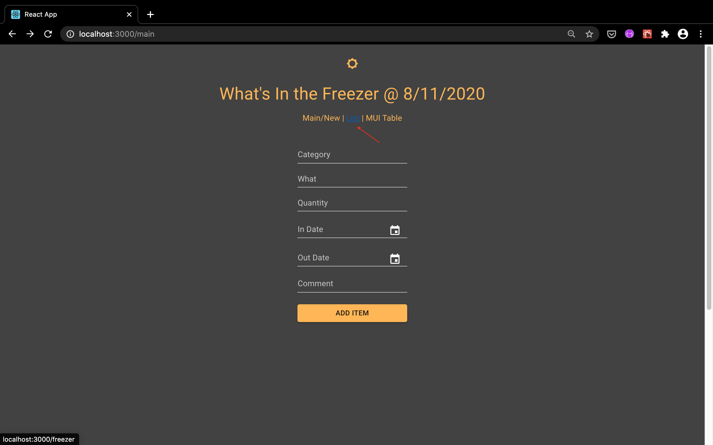

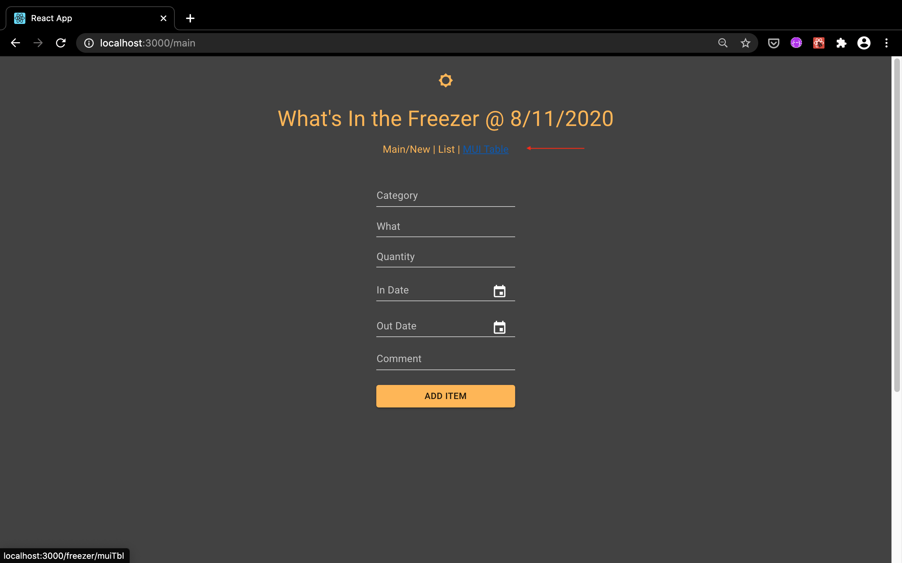

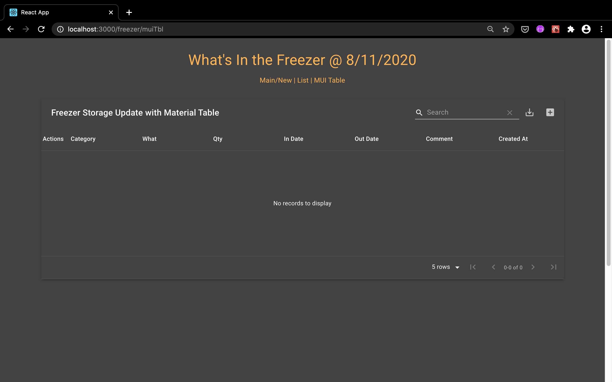

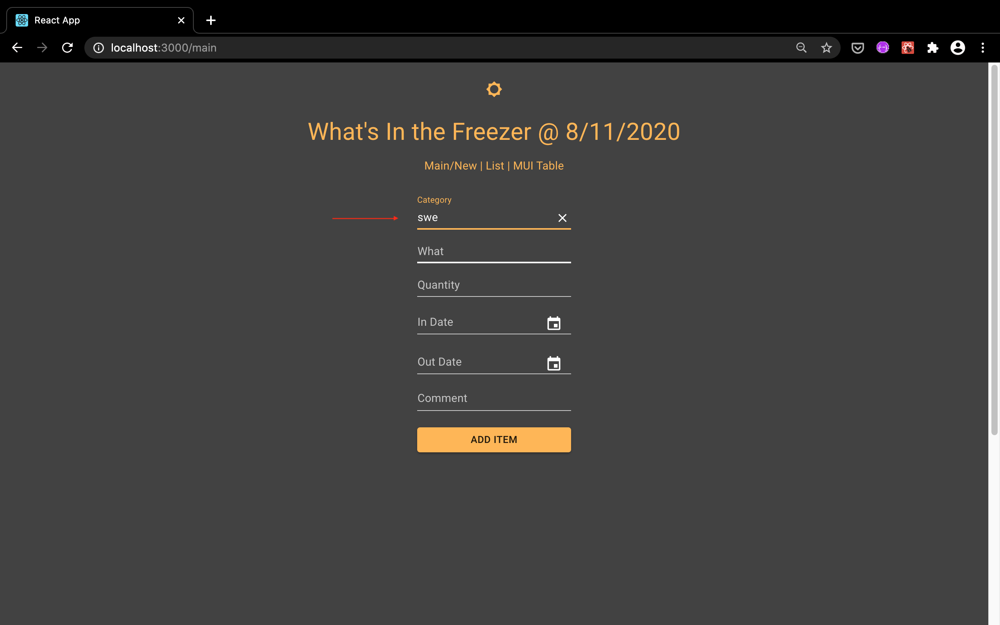
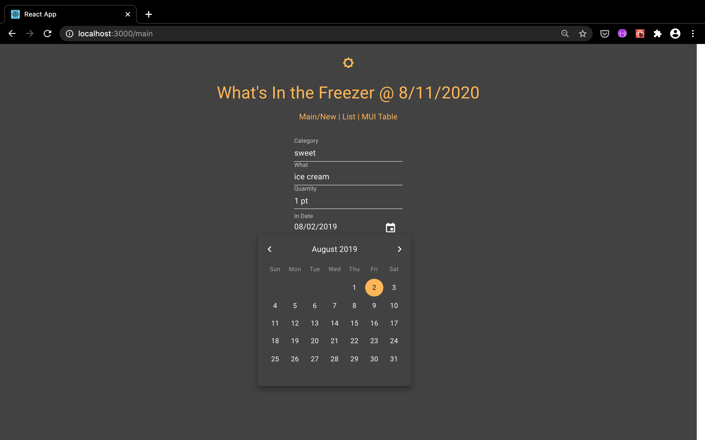

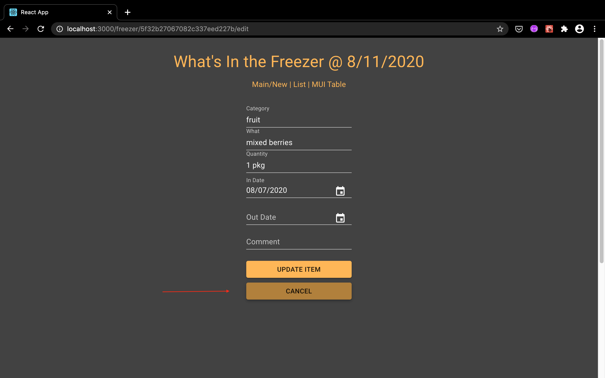
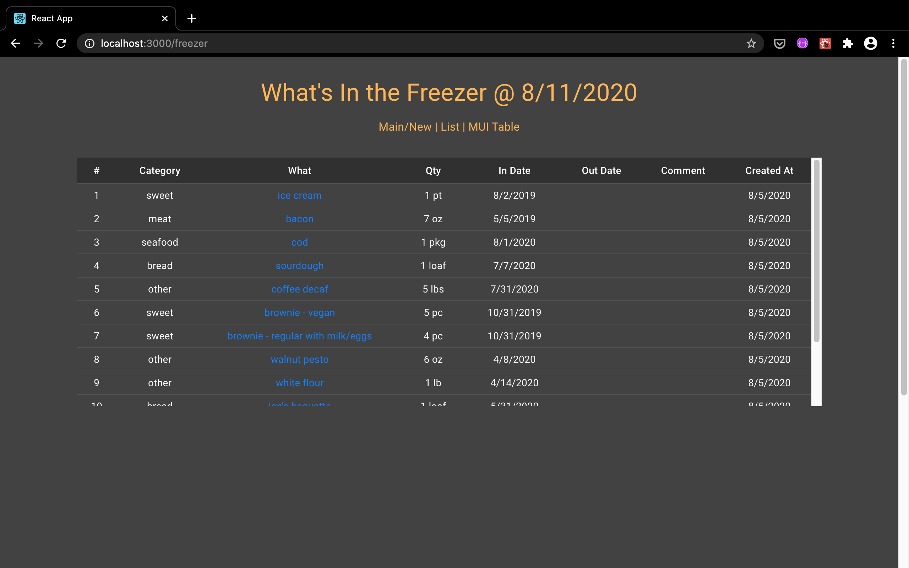  
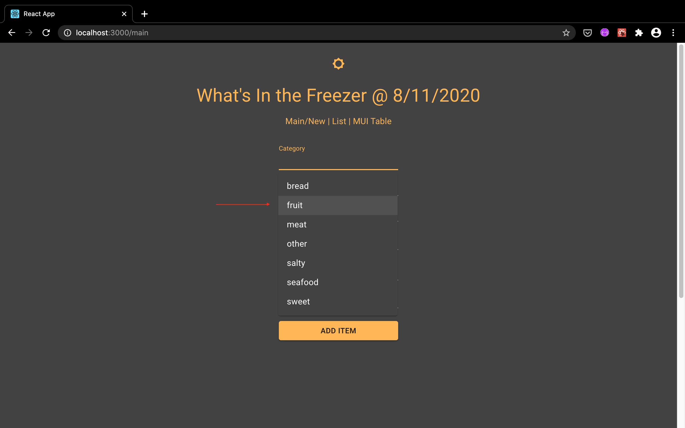  

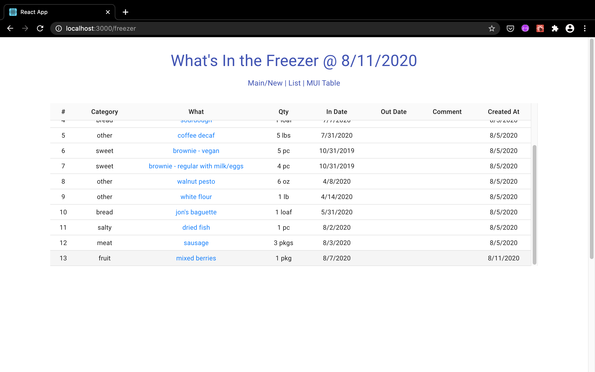

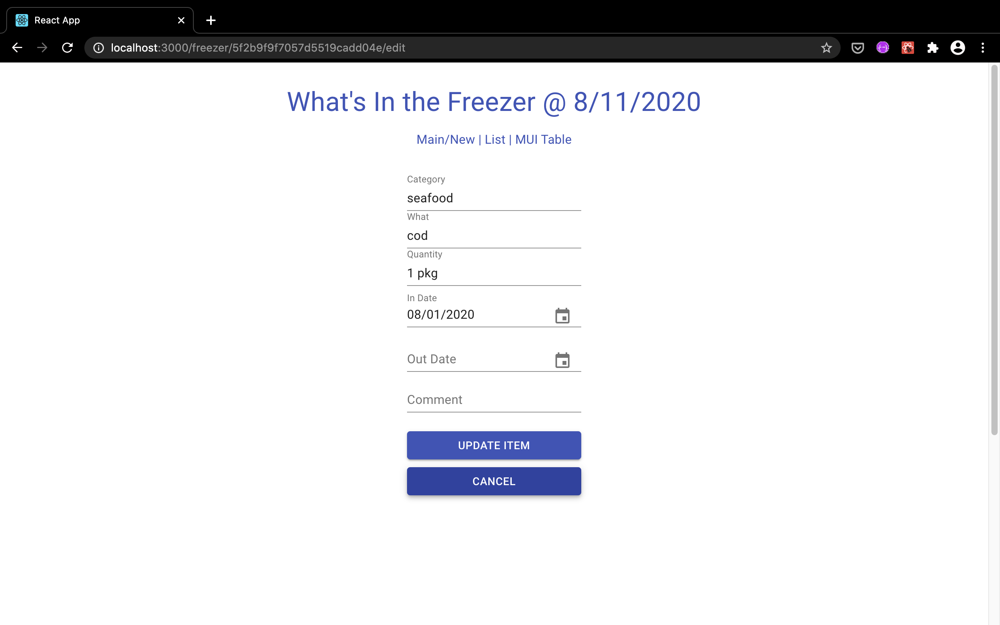

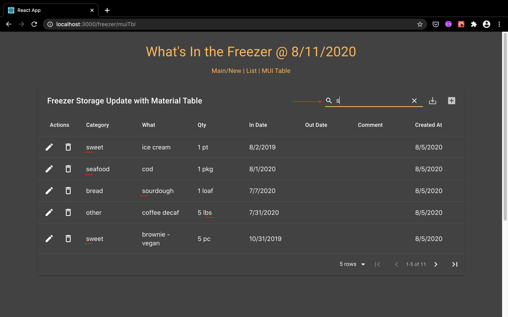

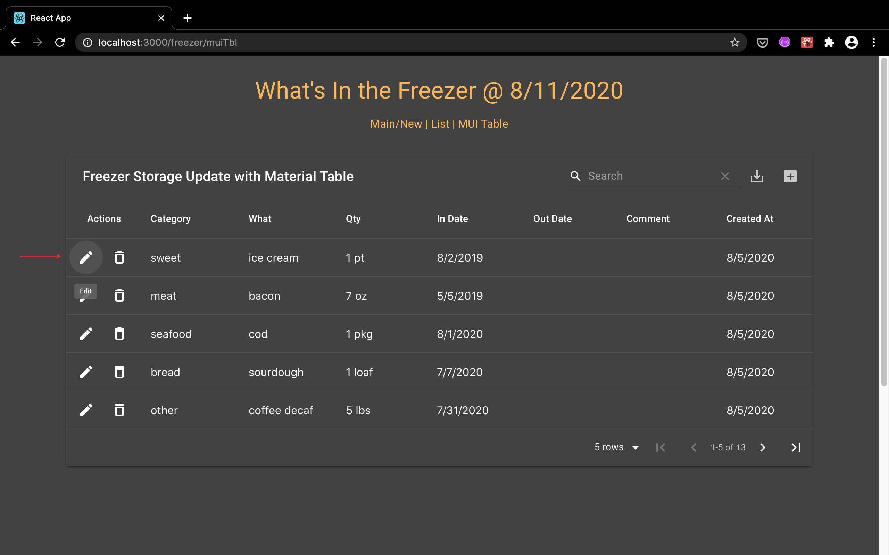

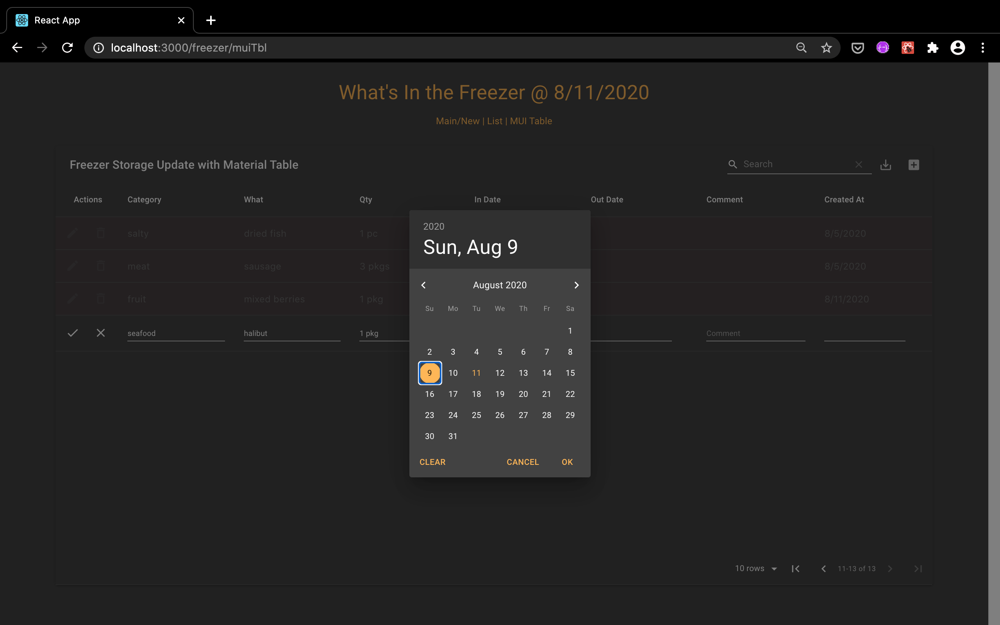
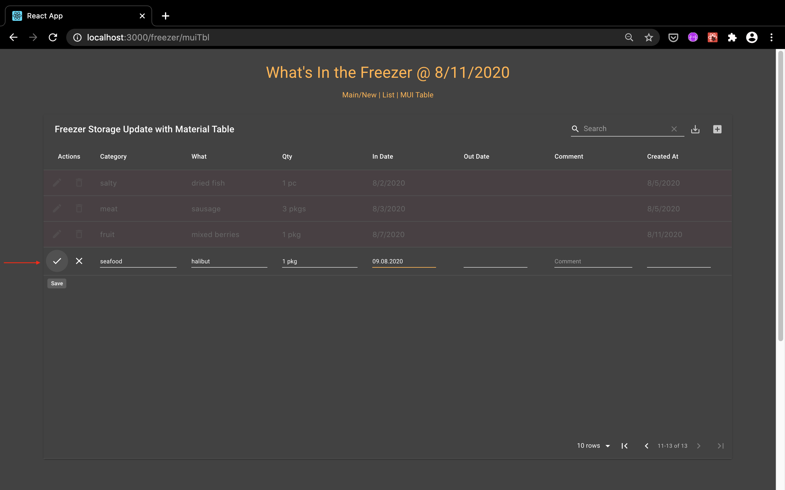

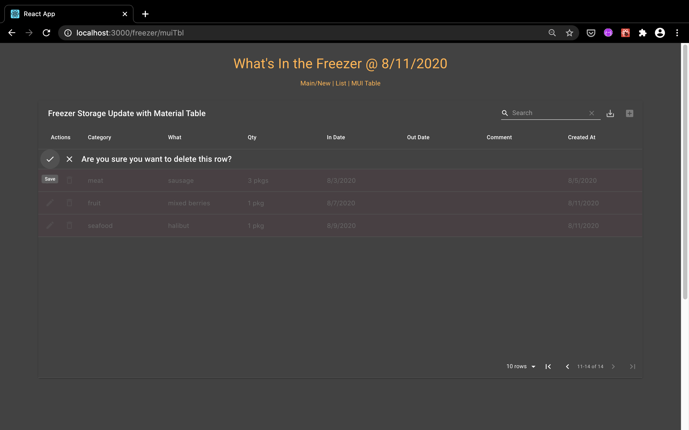

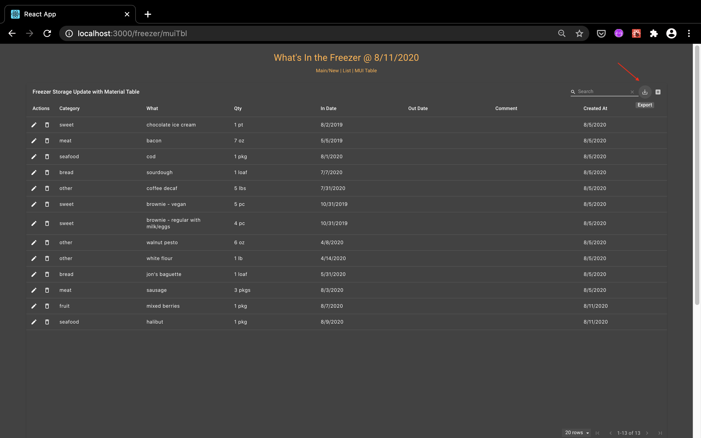

[Exported PDF Version](Screenshots/Freeze-or-Spoil_64_FreezerStorageUpdateWithMaterialTable.pdf)
<!-- [Exported_PDF_Version](./Screenshots/Freeze-or-Spoil_64_FreezerStorageUpdateWithMaterialTable.pdf) this relative link also works -->

